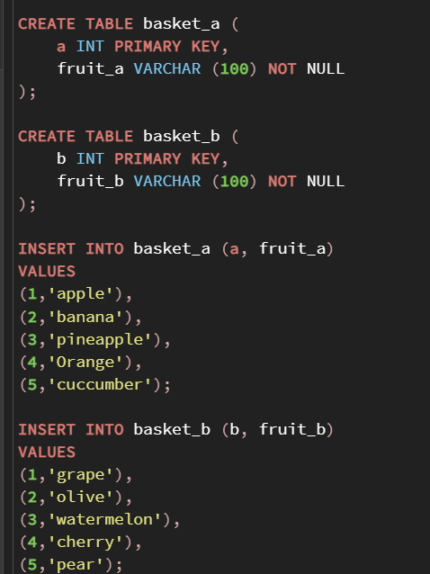

# postgreSQL JOINS
서로 관계가 있는 테이블들이 컬럼의 값들을 비교해서 같은 값들끼리 inner join, left join, right join, fullo uter join을 사용할 수 있다.

### 테이블 세팅

다음과 같이 basket_A과 basket_b라는 과일 관련 정보에 대해서 저장하는 테이블이 
있다고 세팅을 해보자.

> 이제 두 테이블에 대해서 같은 값이 있을 경우, JOIN 했을 경우를 한번 보자.
