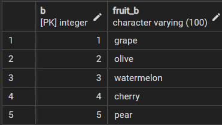

# postgreSQL JOINS
서로 관계가 있는 테이블들이 컬럼의 값들을 비교해서 같은 값들끼리 inner join, left join, right join, fullo uter join을 사용할 수 있다.

### 테이블 세팅

다음과 같이 basket_A과 basket_b라는 과일 관련 정보에 대해서 저장하는 테이블이 
있다고 세팅을 해보자.

> 각 두 테이블의 값을 보면
* basket_a
> 

* basket_a
> 

### INNER JOIN
>SELECT 
    &nbsp;&nbsp;&nbsp;&nbsp;&nbsp;
    a, 
	&nbsp;&nbsp;&nbsp;&nbsp;&nbsp;
    fruit_a, 
    &nbsp;&nbsp;&nbsp;&nbsp;&nbsp;
    b, 
    &nbsp;&nbsp;&nbsp;&nbsp;&nbsp;
    fruit_b; 
FROM 
	&nbsp;&nbsp;&nbsp;&nbsp;&nbsp;&nbsp;
    basket_a 
<u><b>INNER JOIN</u></b> basket_b 
	&nbsp;&nbsp;&nbsp;&nbsp;&nbsp;&nbsp;
    ON fruit_a=fruit_b; 

다음을 쿼리문에 돌려보면 다음과 같이 나오는 것을 확인할 수 있다.

> Inner join은 같은 값이 있을 경우 교집합의 결과로 JOIN된 테이블이 나오는 것인데, 위의 두 테이블을 보면 
둘이  frui_a 컬럼에서의 값들과 fruit_b에서의 컬럼의 갑 중 일치하는 것이 없음을 확인 할 수 있다. 그렇다면 공통적으로 가질 수 있는 값을 basket_a 테이블에 insert해서 확인해보자.

> 다음과 같이 basket_a 테이블에 basket_b에 있는 grape를 추가하면

> 다시 inner join 쿼리를 돌리면 다음과 같이 결과가 나온다.

### LEFT JOIN
basket_a 에 basket_b 테이블을 left join 한다는 뜻은 basket_b가 basket_a 오른쪽 옆에 join 한다는 뜻이다. 이전에 JOIN에서 공통적으로 갖고 있는 값을 기준으로 join을 했단 반면, left join은 왼쪽의 테이블이 기준이 되고, 오른쪽에 붙는 테이블은 왼쪽에 있는 테이블중  <b><i>공통으로 갖는 값만 </b></i> 붙는다

### 예시

>SELECT 
    &nbsp;&nbsp;&nbsp;&nbsp;&nbsp;
    a, 
	&nbsp;&nbsp;&nbsp;&nbsp;&nbsp;
    fruit_a, 
    &nbsp;&nbsp;&nbsp;&nbsp;&nbsp;
    b, 
    &nbsp;&nbsp;&nbsp;&nbsp;&nbsp;
    fruit_b; 
FROM 
	&nbsp;&nbsp;&nbsp;&nbsp;&nbsp;&nbsp;
    basket_a 
<u><b>LEFT JOIN</u></b> basket_b 
	&nbsp;&nbsp;&nbsp;&nbsp;&nbsp;&nbsp;
    ON fruit_a=fruit_b; 

### 출력 결과
> 

출력 결과를 보면 두 테이블이 공통으로 갖는 'grape'를 제외하고는 오른쪽에서 들어오는 basket_b 테이블에 있던 항목들은 null 값으로 되어있는 것을 확인 할 수 있다. 즉, 이 방식을 다이어그램으로 그려보면 다음과 같다.

또, 교집합 부분을 제외하고 싶다면 여기서 
다음 syntax 하나만 추가하면 된다.
> where b is null;

>SELECT 
    &nbsp;&nbsp;&nbsp;&nbsp;&nbsp;
    a, 
	&nbsp;&nbsp;&nbsp;&nbsp;&nbsp;
    fruit_a, 
    &nbsp;&nbsp;&nbsp;&nbsp;&nbsp;
    b, 
    &nbsp;&nbsp;&nbsp;&nbsp;&nbsp;
    fruit_b; 
FROM  
	&nbsp;&nbsp;&nbsp;&nbsp;&nbsp;&nbsp;
    basket_b 
<u><b>RIGHT JOIN</u></b> basket_a 
	&nbsp;&nbsp;&nbsp;&nbsp;&nbsp;&nbsp;
    ON fruit_a=fruit_b; 

이렇게 되면 다음과 같이 교집합 부분을 제외하고 나오게 된다.

Right JOIN도 이전에 Left join과 같이 Join을 하려고 오는 친구를 NULL로 지정하면
> Where a is NULL;

syntax를 사용하여 자신이 속한 집합을 NULL로 지정하여, 교집합 부분을 제외 할 수
있다. 해당 syntax를 뒤에 추가하면 다음과 같이 결과가 나온다.

### PostgreSQL full outer Join
이전에 세팅을 했을 때, A테이블에서만 B 에 있는 grape 값을 공통으로 갖고 있었다, 다음 실습을 하기 위해서는 B 테이블에도 a 테이블에 있는 값을 삽입해줘야 한다.\

결과를 보면, fruit_a 테이블을 기준으로 outer Join을 했기 때문에, 결과를 보면, a 테이블은 기존의 순석대로 정렬되고 뒤의 행이 null로 추가되면서 fruit_b에 매치 되지 않는 열 값들에 대응되지 않는 값들이 null로 채워진다. outer join으로 들어오는 fruit_b의 테이블은 또 다른 개념이다. a 테이블에 일치되는 'banana'는 상단에 떨어져서 나오고 나머지 대응되지 않는 값들은 우측 하단에 배치되어 있는 것을 확인할 수 있다.

### Full outer join
