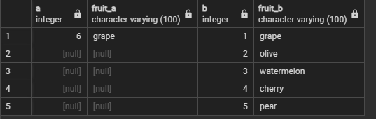
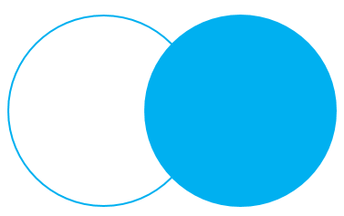
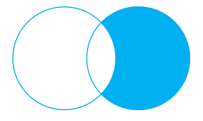
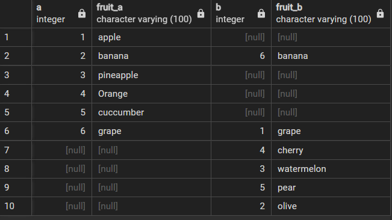
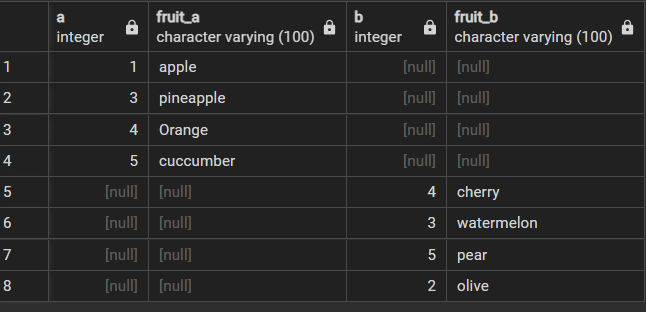

### Right join

이전에 left 조인과 반대된다고 생각하면 된다. right 쪽에 있는 테이블을 기준으로 왼쪽에 테이블이 하나 붙는다고 생각하면 된다.

>SELECT 
    &nbsp;&nbsp;&nbsp;&nbsp;&nbsp;
    a, 
	&nbsp;&nbsp;&nbsp;&nbsp;&nbsp;
    fruit_a, 
    &nbsp;&nbsp;&nbsp;&nbsp;&nbsp;
    b, 
    &nbsp;&nbsp;&nbsp;&nbsp;&nbsp;
    fruit_b; 
FROM 
	&nbsp;&nbsp;&nbsp;&nbsp;&nbsp;&nbsp;
    basket_a 
RIGHT JOIN basket_b ON fruit_a = fruit_b;

 출력 결과를 보면 우측에서 join하는 b 테이블의 경우에는 모든 값들이 들어오게 된다. 반면, 좌측에 있던 a 테이블의 경우에는 b 테이블과 일치하는 grape를 제외하고는 전부 null 이 된다. 
 
 >즉, left join과 유사하게 들어오는 방향쪽에서의 값들은 유지되고 원래 존재하고 있던 테이블에서는 들어오는 테이블과 일치하는 값들을 제외하고는 전부 null로 변하고 위에서부터 공통으로 가지는 값들만 나열된다.

 #### 벤 다이어그램으로 그려보면 다음과 같이 나온다고 생각하면 된다.
 

 만약 교집합을 제외하고 싶다면 마지막에 
 > where basket_a is null;
 을 추가해서 기존의 빈 테이블과의 교집합으로 인해서 다음과 같이, 교집합이 빈 테이블이 벤 다이어그램에서 그려진다.
 

 # full outer join

 벤 다이어그램을 지금까지 여럿 그려보면서, 이제는 합집합을 구하고 싶어할 것이다. 이를 해결해줄 수 있는 쿼리문으로 full outer join이 있다.

 >SELECT 
    &nbsp;&nbsp;&nbsp;&nbsp;&nbsp;
    a, 
	&nbsp;&nbsp;&nbsp;&nbsp;&nbsp;
    fruit_a, 
    &nbsp;&nbsp;&nbsp;&nbsp;&nbsp;
    b, 
    &nbsp;&nbsp;&nbsp;&nbsp;&nbsp;
    fruit_b; 
FROM 
	&nbsp;&nbsp;&nbsp;&nbsp;&nbsp;&nbsp;
    basket_a 
FULL OUTER JOIN basket_b  
&nbsp;&nbsp;&nbsp;&nbsp;ON fruit_a = fruit_b;

출력 결과

다음 결과를 보면 basket_a, basket_b 테이블에 공통으로 존재하는 banana, grape는 마지막에 있는 ON 뒤의 조건 때문에 존재하게 된다. 또, 이전의 join과는 다르게 b에만 존재하는 cherry, watermellon, pear, olive 값이 아직 살아 있는 것을 확인할 수 있다.

#### 만약 합집합에서 교집합을 뺀 값을 찾고 싶다면...
where와 or를 사용한다면 다음 조건도 문제 없다.

 >SELECT 
    &nbsp;&nbsp;&nbsp;&nbsp;&nbsp;
    a, 
	&nbsp;&nbsp;&nbsp;&nbsp;&nbsp;
    fruit_a, 
    &nbsp;&nbsp;&nbsp;&nbsp;&nbsp;
    b, 
    &nbsp;&nbsp;&nbsp;&nbsp;&nbsp;
    fruit_b; 
FROM 
	&nbsp;&nbsp;&nbsp;&nbsp;&nbsp;&nbsp;
    basket_a 
FULL JOIN basket_b  
&nbsp;&nbsp;&nbsp;&nbsp;ON fruit_a = fruit_b; 
WHERE a IS NULL OR b IS NULL;

출력 결과

이를 벤 다이어그램으로 그려보면,

