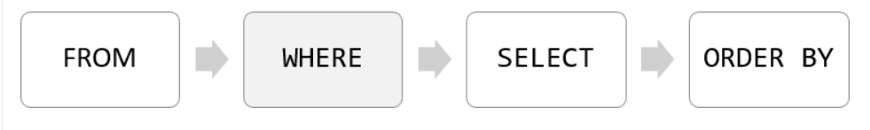

# where
우리가 작문 수업을 배울 때, 6개의 w로 질문을 구체화하듯이 where는 검색해 오는 테이블 정보를 <b>필터(원하는 조건으로 걸러서)</b>

## where 의 사용법
> where는 FROM이 사용되고 나서 뒤에 붙어서 테이블에서 오는 정보들을 필터하게 된다.

> where 뒤의 조건은 항상 데이터 값들에 대해서 true, false, 또는 unkown으로 값이 나오게끔 설정해야 한다. AND나 OR를 사용해서 조건에 대한 합 연산 또는 곱 연산으로 필터 조건을 다양화할 수 있다.

> PostGRE에서 syntax를 컴파일 할 때, 다음 수선대로 syntax를 처리하게 된다.
 
 
 <i>즉, 가져올 테이블을 결정하고 필터링을 한 다음에 추출한 다고 생각하면 된다.</i>

 ## 사용법

 ### = 
 > 값이 동일한지 필터

### >, <, >=, <=
 > 값의 대소 비교를 위한 필터

### <> or !=
 > 왼쪽 값과 오른쪽 값이 불일치하는지를 묻는 필터

### AND
 > 논리연산자 AND

### OR
 > 논리연산자 OR

### IN
 > 리스트에 해당 값이 있는지 booean 값으로 판별

### BETWEEN
 > 리스트에 있는 중간 값인지 booean 값으로 판별

 ### LIKE
 > VALUE에 패턴(&를 활용해서 VALUE의 어미에 해당 값이 있는지, 어두에 있는 지 등)이 일치하지에 따라서 BOOLEAN 반환

 ### IS NULL
 > 해당 VALUE 값에 NULL 이 있으면 TRUE 반환

 ### NOT
 > 부정문

 

