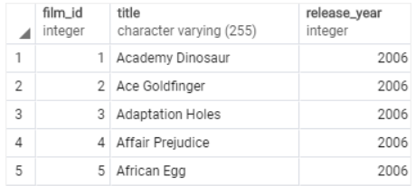

# Limit
limit은 사실 SELECT의 부가적으로 붙는 syntax다. 

다음과 같이 쿼리문을 작성한다면
> <b>SELECT</b>
     &nbsp;&nbsp;&nbsp;select_list 
<b>FROM</b>
     &nbsp;&nbsp;&nbsp;table_name 
<b>LIMIT</b>
    &nbsp;&nbsp;<u>row_count OFFSET row_to_skip</u>;

row_to_skip에 속해 있는 row들을 스킵하는 연산을 진행하고 row_count 행만 가져오게 된다.
즉, LIMIT은 해당 조건에 속해 있는 행들을 가져오고, OFFSET 조건을 사용한다면 OFFSET 뒤에오는 조건들을 제외하고 가져오게 된다.

<I>OFFSET을 사용할 때는, 오름차순 기준으로 했을 때, 작은 값부터 연속적으로 OFFSET 뒤에 오는 값만큼 제외한다.</I> <B>그렇기 때문에, ORDER BY syntax를 사용해서 순서를 정하고 사용하는 것이 좋다.</B>

### 예제
> SELECT
	 &nbsp;&nbsp;&nbsp;film_id, 
	&nbsp;&nbsp;&nbsp;title, 
	&nbsp;&nbsp;&nbsp;release_year  
FROM 
	&nbsp;&nbsp;&nbsp;film 
ORDER BY 
	&nbsp;&nbsp;&nbsp;film_id 
LIMIT 5;

<i>다음과 같이 쿼리문을 입력한다면 </i> LIMIT에 의해서 5개의 행을 SELECT에 의해서 정해진 컬럼들을 가져오게 된다.
    

### OFFSET을 활용한 LIMIT

SELECT
	 &nbsp;&nbsp;&nbsp;film_id, 
	&nbsp;&nbsp;&nbsp;title, 
	&nbsp;&nbsp;&nbsp;release_year 
FROM 
	&nbsp;&nbsp;&nbsp;film 
ORDER BY 
	&nbsp;&nbsp;&nbsp;film_id 
<b>LIMIT 4 OFFSET 3</b>;
다음과 같이 입력한 쿼리문에서는 film_id를 기준으로 정렬되기 때문에 OFFSET의 3에 의해서 film_id 값이 1~3인 행은 제외된다.

## 주로 Limit을 사용하는 이유
> Limit을 사용하는 주 이유는 원하는 데이터 값의 일부만 가져올 때다, 주로 ORDER BY와 같이 사용해서 <b>상위권</b> 또는 <b>하위권</b>만을 가져올 때 주로 사용된다.

예제에서 사용되는 테이블에서 rental 빈도가 가장 높은 영화 품목을 검색하고 싶을 때 다음과 같이 작성하게 된다.

SELECT
     &nbsp;&nbsp;&nbsp; film_id, 
    &nbsp;&nbsp;&nbsp; title, 
    &nbsp;&nbsp;&nbsp; rental rate 
FROM 
    &nbsp;&nbsp;&nbsp; film 
ORDER BY 
    &nbsp;&nbsp;&nbsp; rental rate <u>DESC</u> 
<b>LIMIT 10;<b>

<i>다음과 같이 rental_rate 기준으로 내림차순으로 정렬해서</i> rental_Rate가 가장 높은 영화제목 과 그에 대응하는 영화의 id를 10개 가져올 수 있다.