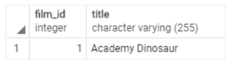
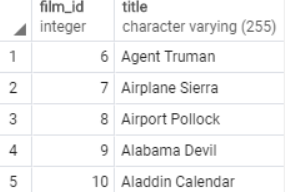

# FETCH
사실 이전 단계에 있는 LIMIT 같은 경우 SQL 표준의 쿼리 문법이 아니다. 원래는 FETCH가 표준에 등록된 SQL문이고 이를 사용하는 것이 <i>더 많은 코드와 호환성이 더 좋을 수 도 있다</i>. 다음은 FETCH 문 사용에 대한 예시이다.

>OFFSET start { ROW | ROWS } 
>FETCH { FIRST | NEXT } [ row_count ] { ROW | ROWS } ONLY

형태를 보면 알 수 있듯이 LIMIT과 거의 차이가 없다. 다만, 아까 말했듯이 더 많은 코드와 호환되기 위해서는, 먼저 등록된 FETCH를 사용하는 것이 좋다.

# 예제
SELECT 
    &nbsp;&nbsp;&nbsp;film_id,  
    &nbsp;&nbsp;&nbsp;title  
    
FROM 
    &nbsp;&nbsp;&nbsp;film 
ORDER BY
    &nbsp;&nbsp;&nbsp;title  
<b>FETCH FIRST 1 ROW ONLY;</b>

라고 입력하게 되면 다음과 같이 1개의 행만 나오게 된다.

LIMIT 과 같이 OFFSET을 활용하게 된다면

>SELECT 
    &nbsp;&nbsp;&nbsp;film_id,  
    &nbsp;&nbsp;&nbsp;title  
FROM 
    &nbsp;&nbsp;&nbsp;film 
ORDER BY 
    &nbsp;&nbsp;&nbsp;title  
<b>OFFSET 5 ROWS 
FETCH FIRST 10 ROW ONLY;</b>

다음과 같이 5~10의 film_id를 가진 행들이 나온다.
