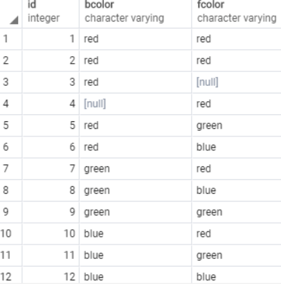

# DISTINCT
데이터를 활용하는 일을 하다 보면 중복된 값이 입력될 경우가 많다. 그렇다면 보통은 입력 오류이거나 운이 좋아서 일치하는 케이스, 또는 오류일 가능성이 많다. 그렇기 때문에 중복인 값을 걸러내는 것은 유용한 기능이다.
> 테이블에서도 이와 같이 중복된 값을 가지는 값들이 있을 때, 중복 없이 불러 올 수 있게 하는 방법이 DISTINCT다. 

 기본적인 사용법은 다음과 같다.
 > SELECT 
   &nbsp;&nbsp;&nbsp;&nbsp;&nbsp;DISTINCT column1 
FROM 
   &nbsp;&nbsp;&nbsp;&nbsp;&nbsp;table_name;

   다음과 같이 쿼리문을 작성했을 때, column1 에서의 값들을 <u>중복 없이</u> 가져오게 된다.

   반면, 다음과 같이 2개의 컬럼에 대해서 DISTINCT를 사용하게 된다면,
   > SELECT 
   &nbsp;&nbsp;&nbsp;&nbsp;&nbsp;DISTINCT column1, column2 
FROM 
   &nbsp;&nbsp;&nbsp;&nbsp;&nbsp;table_name;

   colum1과 column2의 각자의 중복 없는 값들이 나오는 것이 아닌, table에 있는 두 개의 컬럼의 조합을 고유함의 단위로 보고 중복 없는 조합으로 조회 된다.

   두 개의 컬럼을 조회하는 방법 중에서 첫 째 컬럼의 중복 없음을 유지하고, 뒤에 대응되는 컬럼들을 조회하고 싶다면 다음과 같이 DISTINCT ON column1 colum1_alias를 사용하면 된다.
   > SELECT 
   &nbsp;&nbsp;&nbsp;&nbsp;&nbsp;DISTINCT ON (column1) column1_alias,  
   &nbsp;&nbsp;&nbsp;&nbsp;&nbsp;column2 
FROM 
   &nbsp;&nbsp;&nbsp;&nbsp;&nbsp;table_name;

 ## 예제
 다음 색을 value로 가지는 2개의 컬럼에서 DISTINCT를 사용하는 예제를 보자.
<B>
 >SELECT 
	&nbsp;&nbsp;&nbsp;&nbsp;&nbsp;&nbsp;id, 
	&nbsp;&nbsp;&nbsp;&nbsp;&nbsp;&nbsp;bcolor, 
	&nbsp;&nbsp;&nbsp;&nbsp;&nbsp;&nbsp;fcolor 
FROM 
	&nbsp;&nbsp;&nbsp;&nbsp;&nbsp;&nbsp;distinct_demo ; </B>

<I>다음과 같이 출력된다고 할 때</I>

<I>이렇게 DISTICT syntax를 사용한다면</I>

> SELECT 
 &nbsp;&nbsp;&nbsp;&nbsp;&nbsp;&nbsp; DISTINCT bcolor 
 FROM  
 &nbsp;&nbsp;&nbsp;&nbsp;&nbsp;&nbsp;distinct_demo 
 ORDER BY
 &nbsp;&nbsp;&nbsp;&nbsp;&nbsp;&nbsp;bcolor;

 <I>다음과 같이 나온다</I>

 <I>여러 개의 컬럼을 사용하게 된다면</I>

 

 <I>다음과 같이 두 개의 컬럼에 대응되는 값들의 조합 중에서 중복이 없게 조회된다.</I>

 ### DISTINCT ON 예제

 다음 색 중 bcolor의 단일성은 유지하고 싶다면 다음과 같이 DISTINCT ON을 사용해서 bcolor의 단일성을 유지시키면 된다.

 > <b>SELECT 
	 &nbsp;&nbsp;&nbsp;&nbsp;&nbsp;&nbsp;DISTINCT ON (bcolor) bcolor,  
	 &nbsp;&nbsp;&nbsp;&nbsp;&nbsp;&nbsp;fcolor  
FROM  
	 &nbsp;&nbsp;&nbsp;&nbsp;&nbsp;&nbsp;distinct_demo  
ORDER BY 
	 &nbsp;&nbsp;&nbsp;&nbsp;&nbsp;&nbsp;bcolor, 
	 &nbsp;&nbsp;&nbsp;&nbsp;&nbsp;&nbsp;fcolor; </b>

<i>다음과 같이 쿼리문을 입력하면 다음과 같이 컬럼 1의 단일성을 유지하면서 조회가 이루어진다.</i>

