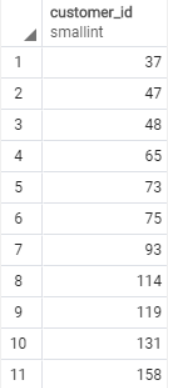

# IN
이전에 where를 사용하면서 조회하고 싶은 값들을 조건에 따라 조회한적이 있다. 이번에는 범위에 해당 값이 있는지 확인하는 연산자에 대해서 배워볼 것이다.

## IN 의 usage
> value in (value1, value2, ...)

<i> 다음과 같이 섭쿼리문을 사용하게 된다면 쿼리문 내에서 해당  값이 있는지 확인도 가능하다.</i>

## IN 예제
where 문에서 다음과 같이 IN을 사용한다면 customer_id가 1~2인 행의 값들을 조회가 가능하다.
>SELECT customer_id, 
	&nbsp;&nbsp;&nbsp;&nbsp;&nbsp;&nbsp;rental_id, 
	&nbsp;&nbsp;&nbsp;&nbsp;&nbsp;&nbsp;return_date 
FROM 
	&nbsp;&nbsp;&nbsp;&nbsp;&nbsp;&nbsp;rental 
WHERE 
	&nbsp;&nbsp;&nbsp;&nbsp;&nbsp;&nbsp;customer_id IN (1, 2) 
ORDER BY 
	&nbsp;&nbsp;&nbsp;&nbsp;&nbsp;&nbsp;return_date DESC; 

다음 in 문을 =를 사용해서 다음과 같이 표현도 가능하다.
> WHERE 
	&nbsp;&nbsp;&nbsp;&nbsp;&nbsp;&nbsp;customer_id customer_id=1 OR customer_id=2 

## NOT IN
NOT 을 사용해서 IN 뒤에 오는 값들에 해당하지 않는 row들을 가져올 수 도 있다.

>SELECT 
    &nbsp;&nbsp;&nbsp;&nbsp;&nbsp; customer_id, 
	&nbsp;&nbsp;&nbsp;&nbsp;&nbsp;&nbsp;rental_id, 
	&nbsp;&nbsp;&nbsp;&nbsp;&nbsp;&nbsp;return_date 
FROM 
	&nbsp;&nbsp;&nbsp;&nbsp;&nbsp;&nbsp;rental 
WHERE 
	&nbsp;&nbsp;&nbsp;&nbsp;&nbsp;&nbsp;customer_id NOT IN (1, 2) 
ORDER BY 
	&nbsp;&nbsp;&nbsp;&nbsp;&nbsp;&nbsp;return_date DESC; 

# SubQuery를 사용한 예문

다음과 같이 subquery를 사용한다면 반납날짜가 2005-05-27인 회원의 회원번호를 가져올 수 있다.
>SELECT 
    &nbsp;&nbsp;&nbsp;&nbsp;&nbsp; customer_id, 
FROM 
	&nbsp;&nbsp;&nbsp;&nbsp;&nbsp;&nbsp;rental 
WHERE 
	&nbsp;&nbsp;&nbsp;&nbsp;&nbsp;&nbsp;WHERE CAST (return date AS DATE) = '2005-05-27' 
ORDER BY 
	&nbsp;&nbsp;&nbsp;&nbsp;&nbsp;&nbsp;customr_id; 
    

또, 이렇게 가져온 회원번호를 가지고 해당 회원번호에 해당 하는 회원들의 원하는 정보들을 가져올 수 있다.
> SELECT  
	&nbsp;&nbsp;&nbsp;&nbsp;&nbsp;&nbsp;&nbsp;&nbsp;&nbsp;&nbsp;customer_id, 
	&nbsp;&nbsp;&nbsp;&nbsp;&nbsp;&nbsp;&nbsp;&nbsp;&nbsp;&nbsp;
    first_name, 
	&nbsp;&nbsp;&nbsp;&nbsp;&nbsp;&nbsp;&nbsp;&nbsp;&nbsp;&nbsp;
    last_name 
FROM 
    &nbsp;&nbsp;&nbsp;&nbsp;&nbsp;&nbsp;&nbsp;&nbsp;&nbsp;&nbsp;
	customer 
WHERE 
&nbsp;&nbsp;&nbsp;&nbsp;&nbsp;&nbsp;&nbsp;&nbsp;&nbsp;&nbsp;
	customer_id IN ( 
    &nbsp;&nbsp;&nbsp;&nbsp;&nbsp;&nbsp;&nbsp;&nbsp;&nbsp;&nbsp;
		SELECT customer_id 
        &nbsp;&nbsp;&nbsp;&nbsp;&nbsp;&nbsp;&nbsp;&nbsp;&nbsp;&nbsp;
		FROM rental 
        &nbsp;&nbsp;&nbsp;&nbsp;&nbsp;&nbsp;&nbsp;&nbsp;&nbsp;&nbsp;
		WHERE CAST (return_date AS DATE) = '2005-05-27' 
	) 
ORDER BY customer_id; 

