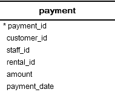
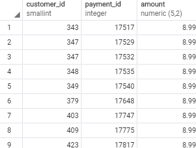
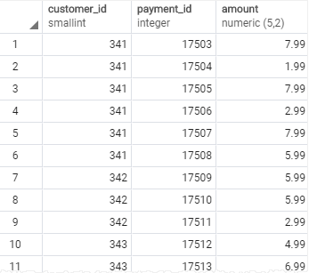
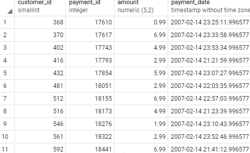

## Between의 사용
> 이전에 말했던 in 같은 경우 "<i>제시해준</i>  값 중에 있어?"라고 묻는다면 between은 "내가 이 값과 이값을 제시해 줄 건데 여기 안에 있어"라고 문는 경우다.

## Between Convention
> value <b>BETWEEN</b> low <b>AND</b> high;

다음과 같이 작성했을 때, low와 high <i>사이에 값이 있다면</i> true를 반환한다.

반대로 범위를 해당 <i>범위 밖에</i> 있는 값들이 맞는지 묻고 싶다면
다음과 같이 부등호 논리연산자를 사용해주면 된다.
>  value >= low AND value <= high

이렇게 쓰는 것 이 거추장 스럽다면 다음과 같이 NOT 연산자를 사용하는 방법도 있다.

> value NOT <b>BETWEEN</b> low <b>AND</b> high;

<i>주로 betwwen 사용자는 조건적으로 필터를 거는데 사용</i>되기 때문에 <i><b>WHERE</b></i> 에서 주로 사용되게 된다.

## 예제

다음과 같이 payment 테이블이 있다고 해보자.

다음 테이블을 이용해서 8$와 9$의 값을 지불한 사람들에 대해서 조회를 하고 싶다면 다음과 같이 쿼리문을 짜면 된다.
>SELECT 
    &nbsp;&nbsp;&nbsp;&nbsp;&nbsp;
    customer_id, 
	&nbsp;&nbsp;&nbsp;&nbsp;&nbsp;&nbsp;
    payment_id, 
	&nbsp;&nbsp;&nbsp;&nbsp;&nbsp;&nbsp;
    amount 
FROM 
	&nbsp;&nbsp;&nbsp;&nbsp;&nbsp;&nbsp;
    payment 
WHERE 
	&nbsp;&nbsp;&nbsp;&nbsp;&nbsp;&nbsp;
    amount BETWEEN 8 AND 9; 

만약 8$와 9$ 사이에 값을 지불한 사람이 아니라 그 외의 범위에서 지불한 사람들을 찾고 싶다면 다음과 같이 쿼리문을 작성하면된다.
>SELECT 
    &nbsp;&nbsp;&nbsp;&nbsp;&nbsp;
    customer_id, 
	&nbsp;&nbsp;&nbsp;&nbsp;&nbsp;&nbsp;
    payment_id, 
	&nbsp;&nbsp;&nbsp;&nbsp;&nbsp;&nbsp;
    amount 
FROM 
	&nbsp;&nbsp;&nbsp;&nbsp;&nbsp;&nbsp;
    payment 
WHERE 
	&nbsp;&nbsp;&nbsp;&nbsp;&nbsp;&nbsp;
    amount <b>NOT</b> BETWEEN 8 AND 9; 

## 날짜를 범위로 지정할 떄
날짜값을 BETWEEN 의 인자로 사용할 때,  ISO 8601 형식에 따라야 한다.

<I>ISO 8601 형식: <B>YYYY-MM-DD</B></I> 

그렇다면 우리가 가져온 테이블에서 2007-02-07과 2007-02-15 사이에 결제를 한 사람들을 불러오는 쿼리문을 작성한다고 해보자.
>SELECT 
    &nbsp;&nbsp;&nbsp;&nbsp;&nbsp;
    customer_id, 
	&nbsp;&nbsp;&nbsp;&nbsp;&nbsp;&nbsp;
    payment_id, 
	&nbsp;&nbsp;&nbsp;&nbsp;&nbsp;&nbsp;
    amount, 
    &nbsp;&nbsp;&nbsp;&nbsp;&nbsp;&nbsp;
    payment_date; 
FROM 
	&nbsp;&nbsp;&nbsp;&nbsp;&nbsp;&nbsp;
    payment 
WHERE 
	&nbsp;&nbsp;&nbsp;&nbsp;&nbsp;&nbsp;
    payment_date  BETWEEN 2007-02-07 AND 2007-02-15; 

