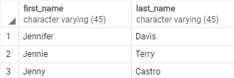
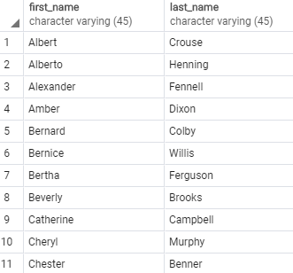
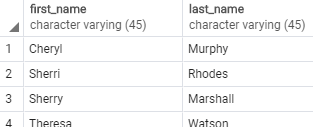
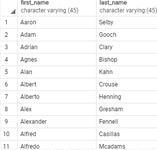
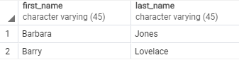

# LIKE
특정 고객을 찾고 싶은 상황에서 해당 고객의 이름이 정확히 기억 나지 않는다고 생각해보자.. 그런데 그 성함에 'Jen'이 들어간다고 어렴풋이 기억나는 상황이 생겼을 때, 대처할 수 있는 수단이다.

다음과 같이 Where 뒤에 Like를 사용하면, first_name 컬럼에 있는 값들 중 Jen이 들어가는 행들을 가져올 수 있다.
>SELECT 
    &nbsp;&nbsp;&nbsp;&nbsp;&nbsp;
    first_name, 
	&nbsp;&nbsp;&nbsp;&nbsp;&nbsp;
    last_name, 
FROM 
	&nbsp;&nbsp;&nbsp;&nbsp;&nbsp;&nbsp;
    customer 
WHERE 
	&nbsp;&nbsp;&nbsp;&nbsp;&nbsp;&nbsp;
    first_name LIKE <u><b>'Jen%';</u></b> 

다음 쿼리문을 따옴표 부분을 자세히 바라본다면, Jen 뒤에 %가 있는 것을 확인 할 수 있다. LIKE 구문을 쓸 때는 다음과 같이 두 개의 syntax에 대해서도 세트로 알아 둘 필요가 있다.

* % &nbsp;: % 좌측의 문자열 또는 숫자가 일치하는 문자열 또는 숫자를
* _ &nbsp;&nbsp;&nbsp;: 위의 %는 여러개의 문자 또는 숫자가 일치할 때 사용하고, _ 같은 겨우 한개의 syntax 즉, 한 개의 문자 또는 숫자가 일치할 경우에 사용된다.

## LIKE uage
pattern과 일치하는지 확인 할 때 다음과 같이 사용된다.
> value LIKE pattern

이전과 같이 해당 패턴과 일치하지 않는 경우를 찾고 싶다면
> value NOT LIKE pattern

## LIKE 사용의 비교

다음 예제 쿼리문을 보면
>SELECT 
    &nbsp;&nbsp;&nbsp;&nbsp;&nbsp;
    'foo' LIKE 'foo', -- 1, 
	&nbsp;&nbsp;&nbsp;&nbsp;&nbsp;
    'foo' LIKE 'f%', -- 2, 
    &nbsp;&nbsp;&nbsp;&nbsp;&nbsp;
    'foo' LIKE '_o_', -- 3, 
	&nbsp;&nbsp;&nbsp;&nbsp;&nbsp;
    'bar' LIKE 'b_'; --4 

* 1 번 경우를 보면 'foo'와 'foo'는 일치하므로 LIKE 연산자는 = 연산자와 같은 역할을 하게된다.
* 2 번 경우를 보면 'f%'에서 '%'앞의 문자가 f로 일치하므로 LIKE 연산자는 1번과 같이 = 연산자의 역할을 하게된다.
* 3 번 경우를 보면 'o'를 기점으로 앞과 뒤에 _가 들어가면서 3글자의 중간에 o가 들어오는 3글자이면 LIKE는 true를 반환하게 된다.
* 4 번 경우를 보면 'b_' b 앞이 b로 시작하는 두 글자라는 뜻이다, 반면에 비교군인 'bar'는 b로 시작하긴 하지만 3글자이므로 LIKE는 = 연산자로 작용해 false를 반환하게 된다.

## 실제 예제
이전에 있었던 고객의 샘플 데이터에서 첫번째 이름에 'er'이 들어가는 사람들의 정보를 가져오는 쿼리문을 작성해보면

>SELECT 
    &nbsp;&nbsp;&nbsp;&nbsp;&nbsp;
    first_name, 
	&nbsp;&nbsp;&nbsp;&nbsp;&nbsp;
    last_name, 
FROM 
	&nbsp;&nbsp;&nbsp;&nbsp;&nbsp;&nbsp;
    customer 
WHERE 
	&nbsp;&nbsp;&nbsp;&nbsp;&nbsp;&nbsp;
    first_name LIKE <u><b>'%er%';</u></b> 
ORDER BY 
    &nbsp;&nbsp;&nbsp;&nbsp;&nbsp;&nbsp;
    first_name;

해당 쿼리문을 작성해본다면, 

위의 출력결과를 바라보면 'Alb<b>er</b>t','Alexand<b>er</b>','B<b>er</b>nald' 등등 모든 문자에 er이 들어간 것을 확인할 수 있다.

이번에는 "_"를 사용하는 예제를 해보자.

her이 들어가는 문자이긴 하지만 앞에는 한 글자만 들어오는 이름을 찾는 쿼리문을 작성한다고 하면
>SELECT 
    &nbsp;&nbsp;&nbsp;&nbsp;&nbsp;
    first_name, 
	&nbsp;&nbsp;&nbsp;&nbsp;&nbsp;
    last_name, 
FROM 
	&nbsp;&nbsp;&nbsp;&nbsp;&nbsp;&nbsp;
    customer 
WHERE 
	&nbsp;&nbsp;&nbsp;&nbsp;&nbsp;&nbsp;
    first_name LIKE <u><b>'_her%';</u></b> 
ORDER BY 
    &nbsp;&nbsp;&nbsp;&nbsp;&nbsp;&nbsp;
    first_name;

출력 결과를 보면, "T<u><b>her</u></b>esa","C<u><b>her</u></b>yl" 등
모두 이름에 her이 들어가면서 her 앞의 글자가 한 글자임을 확인할 수 있다.

## NOT LIKE 사용예제
"Jen"으로 시작하지 않는 이름들을 불러오고 싶을 때, 다음과 같이 쿼리문을 작성해서 할 수 있다.
>SELECT 
    &nbsp;&nbsp;&nbsp;&nbsp;&nbsp;
    first_name, 
	&nbsp;&nbsp;&nbsp;&nbsp;&nbsp;
    last_name, 
FROM 
	&nbsp;&nbsp;&nbsp;&nbsp;&nbsp;&nbsp;
    customer 
WHERE 
	&nbsp;&nbsp;&nbsp;&nbsp;&nbsp;&nbsp;
    first_name NOT LIKE <u><b>'Jen%';</u></b> 
ORDER BY 
    &nbsp;&nbsp;&nbsp;&nbsp;&nbsp;&nbsp;
    first_name;

## LIKE문의 추가 extensions
대문자 소문자 구분을 무시한 값들로만 비교하고 싶을 때, 다음과 같이 LIKE의 extennsions를 사용할 수 있다.

>SELECT 
    &nbsp;&nbsp;&nbsp;&nbsp;&nbsp;
    first_name, 
	&nbsp;&nbsp;&nbsp;&nbsp;&nbsp;
    last_name, 
FROM 
	&nbsp;&nbsp;&nbsp;&nbsp;&nbsp;&nbsp;
    customer 
WHERE 
	&nbsp;&nbsp;&nbsp;&nbsp;&nbsp;&nbsp;
    first_name ILIKE <u><b>'BAR%';</u></b> 

기존의 LIKE 였다면 쿼리문의 응답으로 아무것도 나오지 않을 것이다. extension인 ILIKE를 활용함으로써, 소문자 대문자를 구분하지 않아도 되므로 다음과 같이 두 개의 행이 나오게 된다.

추가적으로 사용할 수 있는 extension들은 다음과 같다.
* ~~: LIKE와 같이 사용할 수 있다.
* ~~*: ILIKE와 같이  사용할 수 있다.
* !~~: NOT LIKE와 같이 사용할 수 있다.
* !~~* NOT ILIKE와 같이 사용할 수 있다.