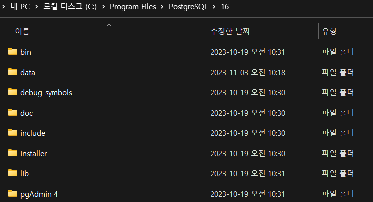
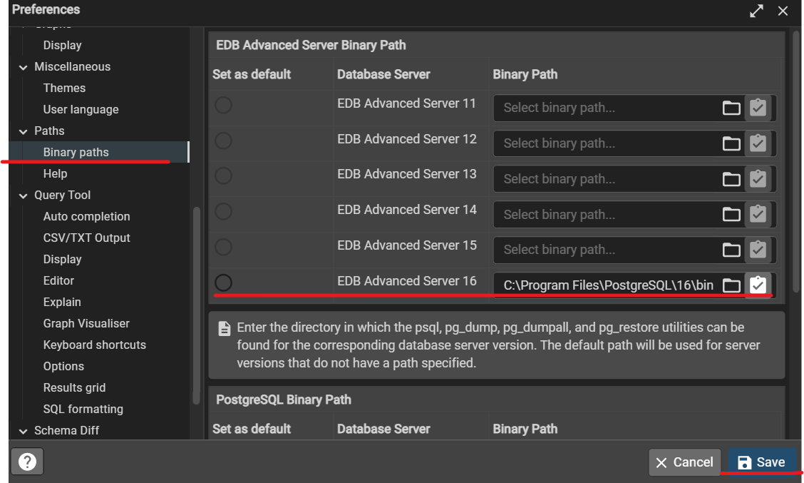

## Please configure the PostgreSQL Path in the Preference Dialog
> pg_restore.exe 파일을 찾지 못해서 생기는 경우

#### Solution
> PostGreSQL이 설치된 로컬 디렉토리로 이동

>해당 디렉토리 내에 있는<i>"bin"</i> 디렉토리를 Binary paths로 설정 

## Binary paths 설정
> PostGre 창에서 File> Preference >Binary paths 선택 후 본인 PostGre 버전에 맞는 디렉토리의 bin 디렉토리 주소를 설정 후 save

