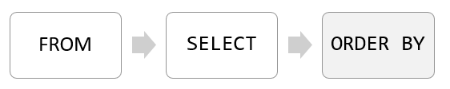
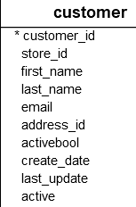
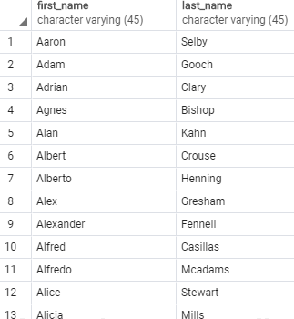
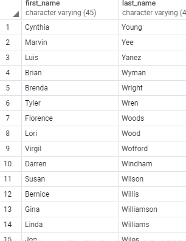
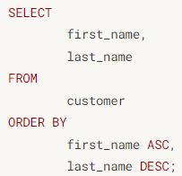
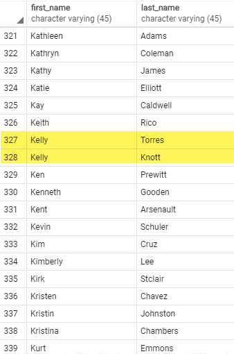

# 돈을 가장 많이 쓴 품목을 보고 싶을 때

엑셀을 사용하다 보면 상단의 세모 버튼을 눌러 오름차순 내지는 내림 차순으로 정렬해서 가장 높거나 가장 낮은 값을 도출해낸 적이 있을 것이다. 

Postgre도 SELECT로 가져오는 값을 오름차순 내지는 내림차순으로 정렬해서 가져올 수 있다.

다음 절을 봐보자

해당 구문에서 ORDER BY 키워드 뒤에 오는 쉼표나 땀표로 해당 구문을 구분할 수 있따. 여러 개의 열을 정렬하고 싶다면 뒤에 쉼표(,)를 둠으로써 해당 쉼표 뒤에 다른 열이 올 수 있게 할 수 있고, 해당 절 뒤에 땀표(;)를 둠으로써 마지막 정렬할 열임을 표시할 수 도 잇
다.

postgreSQL은 SELECT 절을 다음 순서대로 평가하게 된다.

> FROM-> SELECT -> ORDER BY

이 순서 때문에 SELECT 문에 별칭을 붙이는 파트가 있다면. ORDER BY 문에서 사용해야 한다.
다음 예제를 보면 알 수 있을 것이가.

> customre 테이블을 사용해서 정렬하는 예제

* Customer 테이블

다음 customer 테입블에서 성과 이름을 오름차순으로 정렬해보자.

SELECT
     &nbsp;&nbsp;&nbsp;First_name,
     &nbsp;&nbsp;&nbsp;last_name 
FROM
     &nbsp;&nbsp;&nbsp;customer 
ORDER BY
     &nbsp;&nbsp;&nbsp;first_name ASC;

## 결과

> 

다음 결과를 보면 알파벳의 오름차순 정렬에 따라, 다음과 같이 A로 시작하는 first_name의 값들이 상단에 위치하는 것을 확인 할 수 있다.

다음은 위에서 이름이 아닌 성을 내림차순으로 변경해보면 다음과 같이 나올 수 있다.

ORDER BY
     &nbsp;&nbsp;&nbsp;last_name DESC;

## 출력 
> 

## 여러 개의 열을 정렬 했을 경우

이전까지의 열에서는 한 개의 column만 정렬하는 경우이다. 하지만 두 개의 column을 정렬했을 경우에는 어떻게 됄까?

> SELECT
     &nbsp;&nbsp;&nbsp;First_name,
     &nbsp;&nbsp;&nbsp;last_name 
FROM
     &nbsp;&nbsp;&nbsp;customer 
ORDER BY
     &nbsp;&nbsp;&nbsp;first_name ASC;
     &nbsp;&nbsp;&nbsp;last_name DESC;

### 출력

이런 오해가 생길 수 있다. first_name column과 last_name column 따로 정렬될 것이라고 생각할 수 있다. 하지만 실제로는 first_name을 오름차순으로 정렬하고 그 후 오름차순에서 같은 이름이 있으면 DESC에서 내림차순으로 정렬한 결과가 나온다. 