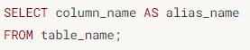
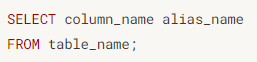
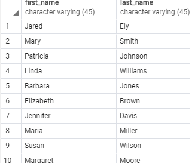
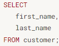
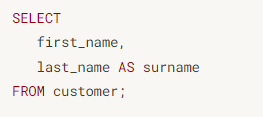
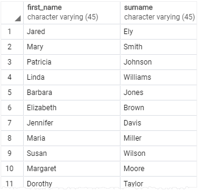
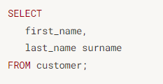

# column을 설정했는데 뭔가 이름이 마음에 안들어...
alias를 사용한다면 이 문제를 해결해준다. 다음 문장을 보면서 이해해보자.

>

이 구문을 실행할 경우 column_name으로 명명된 column은 alias_name으로 설정된다.

여기서 alias는 as라고 생각 하면 된다. 이 때, 또 alias의 특징이 하나 더 있는데, as를 다음과 같이 생략해도 해당 절은 문제없이 돌아간다.

실습을 한번 해보자. 다음과 같이 성과 이름을 불러오는 SELECT절이 있다고 해보자.

<실습 테이블>

조금 더 격식 있는 형태로 성을 surname으로 바꾸고 싶다면 다음과 같이 절을 변경하면 된다.

이 절이 시행된다면 테이블은 다음과 같이 바뀌게 된다.

아까도 말했듯이, as를 생략할 수도 있다.

이전에 full name 실습을 만들었을 때, 연산을 종류하고 나서 새로 생겨지는 column의 이름이 다음과 같이 나온다는 것을 본 적이 있을 것이다.
> ?column?

변수를 만들었을 때, 변수에 쓰레기 값이 들어간 것처럼 변수는 만들어졌으나 해당 변수에 값이 안 정해졌다고 생각하면 좋다.

그렇다면 해당 작업을 하고 이름을 명명하는 작업을 하고 싶다고 한다면 다음과 같이 진행하면 된다.

> SELECT 
> first_name ||  "&nbsp;&nbsp;"  || last_name 
> as full name
> FROM
> customer;

