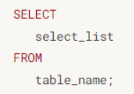
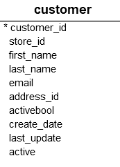
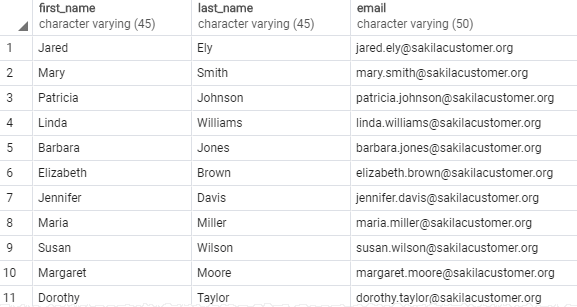
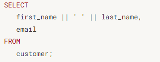
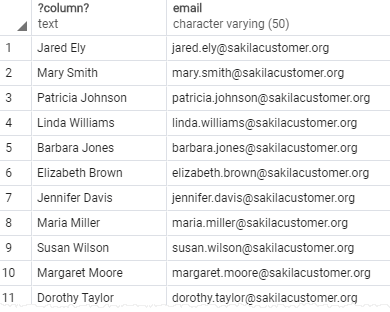

# 가장 많이 쓰는 명령-SELECT

PostGRe SELECT는 가장 복합적으로 쓸 수 있는 명령문이다. 유연하게 사용하기 위해서 많은 절을 갖고 있다.

## 절 종류
* DISTINCT
> 구별이 되는 행을 구하기 위해서 DISTINCT를 사용한다.

* ORDER BY
>  행을 정렬하기 위해서 ORDER BY를 사용한다. 

* WHERE
> 행을 조건에 따라 식별하기 위해서 where를 사용한다.

* FETCH, LIMIT
> FETCH와 LIMIT으로 제약조건을 걸어 일부만 가져올 수 있다.

* GROUP BY
> 행을 그룹 짓기 위해서 GROUP BY 절을 사용한다.

* HAVING
> 그룹을 필터하기 위해서 HAVING 절을 사용한다.

* INNER JOIN, LEFT JOIN, FULL OUTER JOIN, CROSS JOIN
> 절을 사용해서 그룹들을 조인시킨다.

* UNION, INTERSECT, EXCEPT
> 세트 단위로 작업을 수행하기 위해서는 UNION, INTERSECT, EXCEPT 절을 사용한다.

해당 튜토리얼에서는 SELECT와 FROM을 중점적으로 사용할 예정이다.

## PostGRE SQL SELECT statement syntax

가장 기초적인 부분부터 시작해보면

1. 위의 구문에서 볼 수 있듯이 select_list를 선정해야 한다. 선정해야 할 list라 함은, table의 열 내지는 열들이다. 열을 지정하고 싶으면 "," 쉼표를 사용해서 지정하면 되고, 모든 열을 포함시키고 싶으면 "*" 별표를 사용하면 된다.

2. FROM 키워드를 사용해서 SELECT를 사용할 테이블을 지정한다.

### postGRE는 SELECT절에서 FROM을 SELECT보다 먼저 평가한다.

## 예제

다음과 같이 customer 테이블들이 있을 떄, 고객들의 이름만으로 데이터를 가져오고 싶다면 

> SELECT first_name FROM customer;

라는 절을 콘솔에 입력해 추출해 낼 수 있다.

또, 이름 뿐만 아니라 성, 이메일까지 같이 추출하고 싶다면 다음과 같이 절을 작성하면된다.

> SELECT 
>   first_name,
>   last_name,
>   email
>FROM
> customer;

출력 결과
>

### * statement를 사용하지 말아야 하는 이유
 Python, Java, Php를 임베드할 때, 다음과 같은 이유로 인해서 문제가 될 수 있다.

 1. 많은 데이터를 다루는 Postgre에서 *를 선택해 작업을 진행할 경우 모든 열을 하나하나 가져오는 작업을 진행해야 하므로 퍼포먼스 측면으로 봤을 때, 해당 작업은 비효율적인 작업일 수 밖에 없다.
 2. 불필요한 데이터까지 가져온다면 application 서버와 database 서버 사이의 트래픽이 증가하며, 당신의 앱은 응답 속도가 늦어질 것이며, 확장성은 낮다고 판단할 수 밖에 없다.

 그러므로 SELSECT 다음의 오는 조건에 대해서는 여러 절을 사용해서 한정 짓는 것이 좋다.

 ### 고객의 FULL name을 가져와봅시다.

 테이블에서 이름과 성을 column으로 가지고 있었다. 그렇다면 이 결과를 합쳐서 가져올 수 있는 방법은 없을까?

 >

다음과 같이 "||"를 사용하게 된다면 각 행에서 열에 앞의 조건에 해당 하는값과 뒤의 column 조건에 해당하는 값이 합해져서 가져오게 된다.
>

